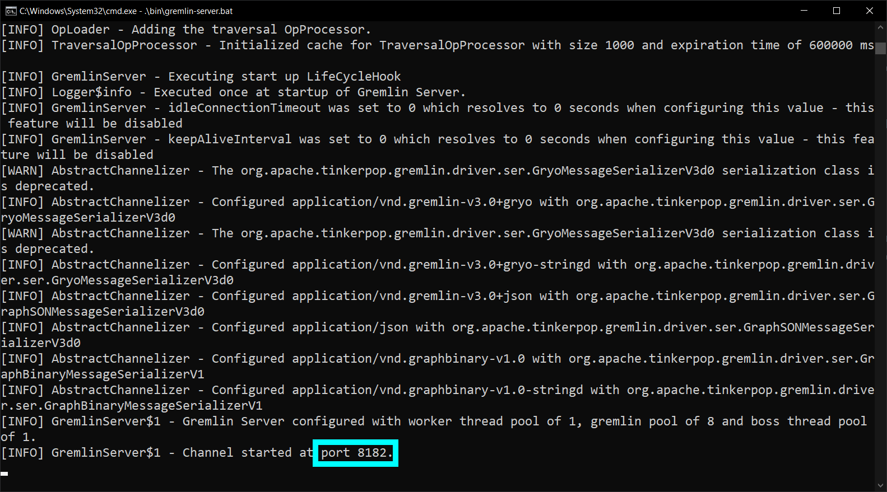
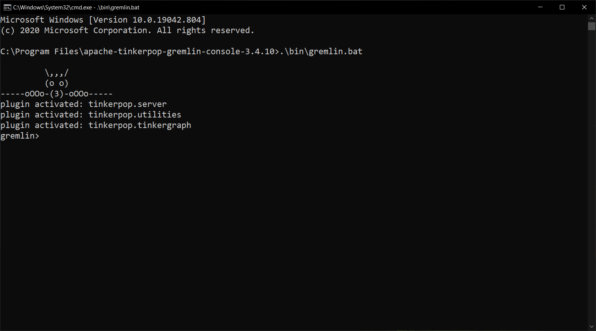
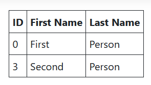

# Connecting to a Gremlin Server From an ASP.NET Web Application

### Introduction

In this article, I will explain how to use [Gremlin.Net](https://tinkerpop.apache.org/docs/3.4.10/reference/#gremlin-dotnet) to connect and send traversals to a Gremlin server from an ASP.NET Web application.

If you would like to follow along, you will need the "Gremlin Server" and the "Gremlin Console" which can be downloaded from the [Apache Tinkerpop Website](https://tinkerpop.apache.org/). And you will need the .NET SDK which can be downloaded from [here](https://dotnet.microsoft.com/download).

### Run the Gremlin Server and Add Sample Data

Navigate to the Gremlin Server root folder then run `./bin/gremlin-server.sh` if you are on Linux or Mac. Or run `.\bin\gremlin-server.bat` if you are on Windows. This should start the Gremlin Server and tell you which port it is listening to. The port is "8182" by default.



Then navigate to the Gremlin Console root folder and run `./bin/gremlin.sh` if you are on Linux or Mac. Or run `.\bin\gremlin.bat` if you are on Windows. This should start the Gremlin Console.



Now enter the following commands in the Gremlin Console.

```
:remote connect tinkerpop.server conf/remote.yaml
:remote console
```

The first command connects the Gremlin Console to the Gremlin Server. And the second command instructs the Gremlin Console to send all the following commands to the server so you do not have to precede every command with `:>`.

Now let's create a couple of vertices so we can pull them and display them in the ASP.NET Web application that we will create later.

```groovy
g.addV('person').property('firstName', 'First').property('lastName', 'Person')
g.addV('person').property('firstName', 'Second').property('lastName', 'Person')
```

### Create the ASP.NET Web Application

Navigate to the folder where you wish to create the ASP.NET Web application then run the following command

```shell
dotnet new webapp
```

Then add the Gremlin.Net NuGet package by running the following command.

```shell
dotnet add package Gremlin.Net
```

### Register the Gremlin Client Objects

Then open "Startup.cs" in the web application project root folder. We need to write some code in the `ConfigureServices()` method to add the Gremlin client objects (or their factory methods) to the container.

The Gremlin client objects we need are `GremlinClient` and `GraphTraversalSource`. The `GremlinClient` can be used to send scripts to the Gremlin Server. Which is something you should avoid as much as possible. But sometimes it is your only option for tasks like defining the graph schema and creating indices. The `GraphTraversalSource` wraps the `GremlinClient` and provides a better interface for building Gremlin traversals and sending them to the server. So the `GraphTraversalSource` is what you will use most of the time.

The big question is: "What should be the lifetime of these objects?". The ASP.NET service container gives you three lifetime options for registering types:

- Transient: A new object is created each time an instance is requested from the container.
- Scoped: A new object is created only once per HTTP request and is reused as many times as needed during this same request processing.
- Singleton: Only one object is created per application lifetime. And this one object is used by all the web application threads potentially running in parallel to process concurrent HTTP requests.

`GremlinClient` is thread safe. So it can be registered as a singleton. And you will probably want to do that because every instance of GremlinClient contains a connection pool. And every time you create an instance of GremlinClient it opens as many connections to the database server as needed to fill the pool. So creating an instance of GremlinClient is a very expensive operation that you do not normally want to do more than once in the application lifetime. The GremlinClient instance is bound to a particular database server, so the only reason to create multiple instances is if you want to connect to multiple database servers.

`GraphTraversalSource` is thread safe too. So it can be registered as a singleton. But creating an instance of GraphTraversalSource is very cheap when you already have the GremlinClient required to create it. So it will not hurt if you register the GraphTraversalSource as a transient or a scoped service. The GraphTraversalSource is bound to a particular graph on the database server. So if your application needs to access multiple graphs, you will need to create multiple GraphTraversalSource instances.

Update the `ConfigureServices()` function in "Startup.cs" to register the `GremlinClient` and the `GraphTraversalSource` as singletons.

```csharp
public void ConfigureServices(IServiceCollection services)
{
    services.AddSingleton<GremlinClient>(
        (serviceProvider) =>
        {
            var gremlinServer = new GremlinServer(
                hostname: "localhost",
                port: 8182,
                enableSsl: false,
                username: null,
                password: null
            );
            
            return new GremlinClient(
                gremlinServer: gremlinServer,
                connectionPoolSettings: new ConnectionPoolSettings
                {
                    PoolSize = 4,
                    MaxInProcessPerConnection = 32,
                    ReconnectionAttempts = 4,
                    ReconnectionBaseDelay = TimeSpan.FromSeconds(1)
                }
            );
        }
    );

    services.AddSingleton<GraphTraversalSource>(
        (serviceProvider) =>
        {
            var gremlinClient = serviceProvider.GetService<GremlinClient>();
            var driverRemoteConnection = new DriverRemoteConnection(gremlinClient, "g");
            return AnonymousTraversalSource.Traversal().WithRemote(driverRemoteConnection);
        }
    );

    services.AddRazorPages();
}
```

The string `"g"` given to the `DriverRemoteConnection` is the identifier of the server-side GraphTraversalSource that the local GraphTraversalSource should be bound to. If the server has multiple graphs, each of them will be exposed to remote clients by a different GraphTraversalSource identifier.

### Execute a Gremlin Traversal

Open "Pages/Index.cshtml.cs" under the project root folder. And change the private property and the constructor to inject an instance of `GraphTraversalSource` instead of the `ILogger`.

```csharp
private readonly GraphTraversalSource _g;

public IndexModel(GraphTraversalSource g)
{
    _g = g;
}
```

Then add a public property on the `IndexModel` to hold the people data that we will fetch from the database.

```csharp
public IList<IDictionary<string, object>> People { get; set; }
```

Unfortunately the Gremlin traversals do not return strongly-typed models. Here the list items will represent people. The dictionary will hold the property names and values of the person. Of course there are ways to map this properties dictionary to a strongly-typed object. But I will not do this here because I want to focus on the basics in this article.

Next, write the Gremlin traversal in the `OnGet()` method to fetch the data from the Gremlin server and assign it to the `People` property.

```csharp
public void OnGet()
{
    People = _g.V()
        .HasLabel("person")
        .Project<object>("Id", "FirstName", "LastName")
            .By(T.Id)
            .By("firstName")
            .By("lastName")
        .ToList();
}
```

There is a small enhancement that I would like to make to the code above. It is always better to execute IO operations asynchronously so we do not block the thread. And Gremlin.Net does provide a `Promise()` function to execute the traversals asynchronously. So let's make the `OnGet()` method async. And replace `.ToList()` by `.Promise(traversal => traversal.ToList())`.

```csharp
public async Task OnGetAsync()
{
    People = await _g.V()
        .HasLabel("person")
        .Project<object>("Id", "FirstName", "LastName")
            .By(T.Id)
            .By("firstName")
            .By("lastName")
        .Promise(traversal => traversal.ToList());
}
```

### Display the Traversal Results In the View

Open "Pages/Index.cshtml" under the project root folder and write the following Razor code to display the people data fetched from the graph database.

```razor
@if (!Model.People.Any())
{
    <p>There are no people in the database.</p>
}
else
{
    <table border="1" cellpadding="5">
        <tr>
            <th>ID</th>
            <th>First Name</th>
            <th>Last Name</th>
        </tr>

        @foreach (Dictionary<string, object> person in Model.People)
        {
            <tr>
                <td>@person["Id"]</td>
                <td>@person["FirstName"]</td>
                <td>@person["LastName"]</td>
            </tr>
        }
    </table>
}
```

### Run the Web Application

Navigate to the web application root folder and run the following command.

```shell
dotnet run
```

Then, from your favorite web browser, navigate to https://localhost:5001/
You may need to replace the port number by whatever port your web server is listening on.

If everything is working as expected, you should see two "person" records displayed on the home page. These two records are coming from the two vertices that we added earlier from the Gremlin Console.


