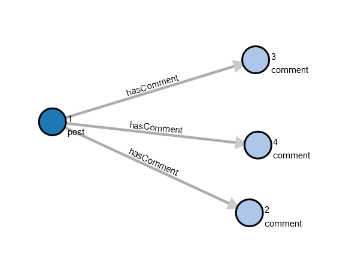

# Gremlin DSL Implementation in C#

### Introduction

Developers can extend the Gremlin traversal language by defining higher-level, domain-specific steps that are made from the lower-level, standard graph traversal steps. This can be used to define steps that are specific to your application domain. Or to define more general-purpose steps to make traversing graphs easier.

These extensions are called Gremlin Domain-Secific Languages (DSLs). They are comparable to SQL stored procedures in that they encapsulate data access logic. But the big difference is that SQL stored procedures are defined on the database server-side. While Gremlin DSLs are defined on the client-side and the server does not know anything about them.

In this article, I will explain how to implement Gremlin.Net DSLs in C#. I will show how to define a `ProjectBy()` function that can be used instead of the standard Gremlin syntax `Project().By()`.

### Sample Graph Data

The following code populates the graph with some sample data: a "post" vertex that is related by "hasComment" edges to three "comment" vertices.

```csharp
static void PopulateGraph(GraphTraversalSource g)
{
    g.AddV("post")
        .Property("slug", "post-1")
        .Property("author", "Author 1")
        .Property("publishedOn", new DateTime(2021, 3, 19, 17, 7, 52))
        .Property("lastUpdate", new DateTime(2021, 4, 2, 8, 45, 3))
        .Property("title", "Post 1")
        .Property("body", "Body 1")
        .As("p1")
        
    .AddV("comment")
        .Property("userName", "User 1")
        .Property("postedOn", new DateTime(2021, 4, 15, 20, 59, 50))
        .Property("title", "Comment 1 Title")
        .Property("body", "Comment 1 body")
        .Property("wasEdited", false)
        .As("c1")
    .AddE("hasComment").From("p1").To("c1")
        
    .AddV("comment")
        .Property("userName", "User 2")
        .Property("postedOn", new DateTime(2021, 4, 18, 16, 48, 44))
        .Property("title", "Comment 2 Title")
        .Property("body", "Comment 2 body")
        .Property("wasEdited", true)
        .As("c2")
    .AddE("hasComment").From("p1").To("c2")
        
    .AddV("comment")
        .Property("userName", "User 3")
        .Property("postedOn", new DateTime(2021, 4, 22, 4, 12, 21))
        .Property("title", "Comment 3 Title")
        .Property("body", "Comment 3 body")
        .Property("wasEdited", false)
        .As("c3")
    .AddE("hasComment").From("p1").To("c3")
        
    .Iterate();
}
```

The following is a visual representation of the graph data.



### The Standard Gremlin Project Syntax

In standard Gremlin, you add a "Project" step by calling `Project()` and passing the project keys as arguments. Then you modulate this Project step by calling `By()` multiple times to specify the value sources for each of the keys. This works well when you are projecting by a small number of keys/values. But I do not like this syntax when the lists of keys and values are long and the key is too far from the corresponding value source.

The following code uses the standard Project syntax to get the post and the related comments information.

```csharp
static IDictionary<string, object> GetPostUsingStandardProject(GraphTraversalSource g)
{
    return g.V().Has("post", "slug", "post-1")
        .Project<object>("id", "slug", "author", "publishedOn", "lastUpdate", "title", "body", "comments")
        .By(T.Id)
        .By("slug")
        .By("author")
        .By("publishedOn")
        .By("lastUpdate")
        .By("title")
        .By("body")
        .By(
            __.Out("hasComment")
            .Project<object>("id", "userName", "postedOn", "title", "body", "wasEdited")
            .By(T.Id)
            .By("userName")
            .By("postedOn")
            .By("title")
            .By("body")
            .By("wasEdited")
            .Fold()
        ).Next();
}
```

### Defining an Alternative "ProjectBy()" Function

Let's create an alternative projection function that takes an `IDictionary<string, ITraversal>` so that the keys are always near the value sources no matter the number of projection keys/values.

This `ProjectBy()` function is an example general-purpose DSL. You add Gremlin.Net DSLs as extension methods to the `GraphTraversal<S, E>` class or the `GraphTraversalSource` class. Or by adding static methods that build anonymous traversals.

Here are the `GraphTraversal<S, E>` extension methods.

```csharp
public static class GraphTraversalExtensions
{
    public static GraphTraversal<S, IDictionary<string, E2>> ProjectBy<S, E, E2>(
        this GraphTraversal<S, E> tIn, IDictionary<string, ITraversal> projectionMap)
    {
        if (tIn is null)
            throw new ArgumentNullException(nameof(tIn));
        if (projectionMap is null)
            throw new ArgumentNullException(nameof(projectionMap));
        if (!projectionMap.Any())
            throw new ArgumentException("The projection map should contain at least one item.", nameof(projectionMap));

        GraphTraversal<S, IDictionary<string, E2>> tOut = tIn.Project<E2>(
            projectionMap.First().Key, projectionMap.Skip(1).Select(kv => kv.Key).ToArray());

        foreach (KeyValuePair<string, ITraversal> keyValue in projectionMap)
        {
            if (keyValue.Value is null)
                tOut = tOut.By(keyValue.Key);
            else
                tOut = tOut.By(keyValue.Value);
        }

        return tOut;
    }

    public static GraphTraversal<S, IDictionary<string, object>> ProjectBy<S, E>(
        this GraphTraversal<S, E> tIn, IDictionary<string, ITraversal> projectionMap)
    {
        return ProjectBy<S, E, object>(tIn, projectionMap);
    }
}
```

Our `ProjectBy()` function takes an `IDictionary<string, ITraversal>`. The dictionary keys are the projection result keys (column headers). And the dictionary values are anonymous traversals that describe how to get the projection values.

Our function calls the standard Gremlin `Project()` function which takes the projection keys as arguments. Then our function calls `By()` for each of the projection items. If no traversal is provided for the projection item, then it is assumed that the key is also the projected property name.

The second `ProjectBy()` overload saves the caller from having to specify the type of the projected values. Usually the type `Object` has to be used because the projected values are of different types.

Now let's create static `ProjectBy()` methods that build anonymous traversals with a "Project" step.

```csharp
public class __Ext
{
    public static GraphTraversal<object, IDictionary<string, E2>> ProjectBy<E2>(
        IDictionary<string, ITraversal> projectionMap)
    {
        return new GraphTraversal<object, object>().ProjectBy<object, object, E2>(projectionMap);
    }

    public static GraphTraversal<object, IDictionary<string, object>> ProjectBy(
        IDictionary<string, ITraversal> projectionMap)
    {
        return ProjectBy<object>(projectionMap);
    }

    public static GraphTraversal<object, object> Values(params string[] propertyKeys)
    {
        return __.Values<object>(propertyKeys);
    }
}
```

Our static `ProjectBy()` method creates an empty traversal then calls the extension `ProjectBy()` method that we defined earlier. So we did not have to repeat the implementation logic.

We created a `ProjectBy()` overload that saves the caller from having to specify the type of the projected values. And we created a `Values()` function that does not require the user to provide a type parameter. Specifying these types is often useless when the result of the projection has to be an `IDictionary<string, object>` anyway.

As I mentioned before, a common way of extending Gremlin.Net is by adding extension methods to the `GraphTraversalSource` class. But this will not be demonstrated in this article because it does not make any sense to add a `ProjectBy()` method to the `GraphTraversalSource`.

### Using the "ProjectBy()" Function

Here is how to use the "ProjectBy()" Function.

```csharp
static IDictionary<string, object> GetPostUsingProjectBy(GraphTraversalSource g)
{
    return g.V().Has("post", "slug", "post-1")
        .ProjectBy(new Dictionary<string, ITraversal>
        {
            { "id", __.Id() },
            { "slug", null },
            { "writer", __Ext.Values("author") },
            { "publishedOn", null },
            { "updateDate", __Ext.Values("lastUpdate") },
            { "title", null },
            { "body", null },
            {
                "comments",
                __.Out("hasComment")
                .ProjectBy(new Dictionary<string, ITraversal>
                {
                    { "id", __.Id() },
                    { "userName", null },
                    { "postedOn", null },
                    { "subject", __Ext.Values("title") },
                    { "body", null },
                    { "wasEdited", null }
                }).Fold()
            }
        }).Next();
}
```

Now the keys are right next to the value sources which makes the traversal more readable and maintainable in my opinion. Also we do not have to specify the value source when we want to get the value of a property which name is the same as the projection key.