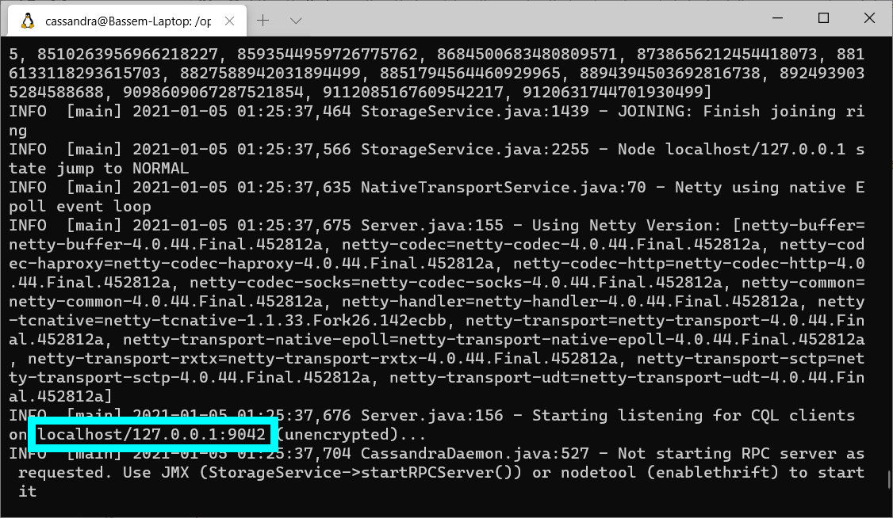

## Installing JanusGraph and Its Storage Backends

# 3. Installing Apache Cassandra for JanusGraph

### Introduction

This is the third article in a series of articles about installing and configuring JanusGraph and its storage backends on a Linux Ubuntu server.

In this article, I will explain how to install and run the Apache Cassandra database. And how to configure JanusGraph to use it as its storage backend.

### Download and Extract Cassandra

At the time of writing this article, [JanusGraph's latest release page on GitHub](https://github.com/JanusGraph/janusgraph/releases/latest) says that JanusGraph is compatible with Cassandra 3.11.0. So I will get this version's download link from the [Apache Cassandra archive](http://archive.apache.org/dist/cassandra/), and I will use the `wget` shell command to download it to my `/opt` directory. Then I will use the `tar` command to extract the contents of the downloaded archive.

```shell
cd /opt
wget http://archive.apache.org/dist/cassandra/3.11.0/apache-cassandra-3.11.0-bin.tar.gz
tar -xf apache-cassandra-3.11.0-bin.tar.gz
```

### Create a Linux User for Running Cassandra

I think it is a good idea to create a Linux user for running the Cassandra server. This user can be given only the permissions needed by Cassandra and not more. This dedicated user will also make it easier to find the Cassandra server process if we need to monitor it or kill it.

```shell
adduser cassandra
```

You will be prompted to enter the password for this new user.

Now let's make this newly created user the owner of the Cassandra root folder and all its contents.

```shell
chown -R cassandra:cassandra apache-cassandra-3.11.0
```

### Run the Cassandra Server

Switch to the "cassandra" user and run the "cassandra" shell script.

```shell
su cassandra
/opt/apache-cassandra-3.11.0/bin/cassandra -f
```

The `-f` flag runs the Cassandra server in the foreground so we can see the output messages and easily shutdown the server when we want by pressing CTRL + c



The screenshot above shows the Cassandra server output. The most important piece of information is the port number that Cassandra is listening to.

### Edit the JanusGraph Configuration to Make It Use Cassandra

Open a new terminal window. Then open the file `/opt/janusgraph-0.5.2/conf/gremlin-server/gremlin-server.yaml` for editing. And change the value of `graphs > graph` as shown below.

```yaml
graphs: {
  graph: conf/janusgraph-cql.properties
}
```

**Note:** Use `janusgraph-cql.properties` instead of `janusgraph-cassandra.properties`. The former instructs JanusGraph to use Cassandra's recommended CQL protocol. While the latter instructs JanusGraph to use Cassandra's deprecated Thrift protocol.

### Start the JanusGraph Server

Switch to the "janus" user that we created in a previous article in this series. Then execute "gremlin-server.sh".

```shell
su janus
/opt/janusgraph-0.5.2/bin/gremlin-server.sh
```


The screenshot above shows the JanusGraph server output. The most important piece of information is the port number that JanusGraph is listening to.

### Test JanusGraph From the Gremlin Console

Open a new terminal window. Switch to the "janus" user. Then run the Gremlin Console.

```shell
su janus
/opt/janusgraph-0.5.2/bin/gremlin.sh
```

Connect the Gremlin Console to the JanusGraph server.

```
:remote connect tinkerpop.server conf/remote.yaml
```

Then enter

```
:remote console
```

to send all the following commands to the server without having to precede them with `:>`

Create two vertices and an edge to connect them.

```
gremlin> g.addV('person').property('name', 'p1')
==>v[4160]
gremlin> g.addV('person').property('name', 'p2')
==>v[4144]
gremlin> g.addE('known').from(g.V(4160)).to(g.V(4144))
==>e[1l4-37k-2dx-374][4160-known->4144]
```

Since these commands were executed successfully, this means that JanusGraph is talking to Cassandra without problems.

### View the Graph Data Saved In Cassandra

Open yet another terminal window. Switch to the "cassandra" user. And run "cqlsh" which is a Cassandra client. Note that you will need to install Python if it is not already installed.

```
su cassandra
/opt/apache-cassandra-3.11.0/bin/cqlsh
```

Get the list of keyspaces.

```
cqlsh> DESCRIBE KEYSPACES;

system_schema  system      system_distributed
system_auth    janusgraph  system_traces
```

You see that JanusGraph created a keyspace "janusgraph". Let's use this keyspace and get the list of tables under it.

```
cqlsh> USE janusgraph;
cqlsh:janusgraph> DESCRIBE TABLES;

edgestore_lock_  graphindex_lock_         janusgraph_ids
txlog            systemlog                graphindex
edgestore        system_properties_lock_  system_properties
```

The most important table is "edgestore". This is where all the graph data (vertices, edges and properties) are stored. So let's view this table data.

```
cqlsh:janusgraph> SELECT * FROM edgestore;

 key                | column1            | value
--------------------+--------------------+----------------------------
 0x0000000000000c15 |               0x02 |                 0x00015480
 0x0000000000000c15 |             0x10c0 |   0xa072741e6b6e6f77ee5080
 0x0000000000000c15 |       0x10c2806400 |           0x8f00018e008080
 0x0000000000000c15 |       0x10c2806800 |           0x9981018e008180
 0x0000000000000c15 |       0x10c2806c00 |           0xad80018e008280
 0x0000000000000c15 |       0x10c2807000 |           0x9981018e008380
 0x0000000000000c15 |       0x10c2807400 |           0xae80018e008480
 0x0000000000000c15 |       0x10c2807800 |           0xb082018e008680
 0x0000000000000c15 |       0x10c2807c00 |           0xb382018e008780
 0x0000000000000c15 |             0x10c4 |                 0x00805880
 0x0000000000000c15 |             0x10c8 |   0x008005b873e162aaf86080
 0x4000000000000080 |               0x02 |                 0x00010488
 0x4000000000000080 |               0x24 |               0x048d0888ff
 0x4000000000000080 |             0x50c0 |               0xa070b10c88
 0x4000000000000080 | 0x70e0802030801008 |                         0x
 0x0000000000000805 |               0x02 |                 0x00012480
 0x0000000000000805 |             0x10c0 |     0xa072741e6e616de52080
 0x0000000000000805 |       0x10c2803400 |           0x8f00018e008080
 0x0000000000000805 |       0x10c2803800 |           0x9981018e008180
 0x0000000000000805 |       0x10c2803c00 |           0xad80018e008280
 0x0000000000000805 |       0x10c2804000 |           0x9981018e008380
 0x0000000000000805 |       0x10c2804400 |           0xae83018e008480
 0x0000000000000805 |       0x10c2804800 |           0xbc92018e008580
 0x0000000000000805 |       0x10c2804c00 |           0xb382018e008780
 0x0000000000000805 |             0x10c4 |                 0x00812880
 0x0000000000000805 |             0x10c8 |   0x008005b873dcbb75c03080
 0x3000000000000080 |               0x02 |                 0x00010486
 0x3000000000000080 |               0x24 |               0x048d0886ff
 0x3000000000000080 |             0x50c0 |               0xa070b20c86
 0x3000000000000080 | 0x70e1802040801008 |                         0x
 0x000000000000020d |               0x02 |                 0x00010880
 0x000000000000020d |             0x10c0 | 0xa0766c1e706572736fee0480
 0x000000000000020d |       0x10c2801800 |           0x8f00018e008f80
 0x000000000000020d |       0x10c2801c00 |           0x8f00018e009080
 0x000000000000020d |             0x10c4 |                 0x00820c80
 0x000000000000020d |             0x10c8 |   0x008005b873dcb0e2b81480

(36 rows)
```

The data is not human readable. But at least we know where it is.

---

**Other articles in this series:**

1. [Installing JanusGraph and Testing it With the InMemory Storage Backend](../installing-janusgraph-and-testing-it-with-the-inmemory-storage-backend/index.md)
2. [Configuring JanusGraph to Use Oracle Berkeley DB](../configuring-janusgraph-to-use-oracle-berkeley-db/index.md)
3. Installing Apache Cassandra for JanusGraph
