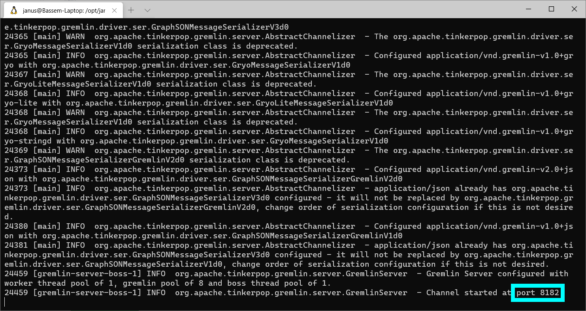

## Installing JanusGraph and Its Storage Backends

# 4. Installing Apache HBase for JanusGraph

### Introduction

This is the fourth article in a series of articles about installing and configuring JanusGraph and its storage backends on a Linux Ubuntu server.

In this article, I will explain how to install and run the Apache HBase database. And how to configure JanusGraph to use it as its storage backend.

### Download and Extract HBase

At the time of writing this article, [JanusGraph's latest release page on GitHub](https://github.com/JanusGraph/janusgraph/releases/latest) says that JanusGraph is compatible with HBase 2.1.5. So I will get this version's download link from the [Apache HBase archive](https://archive.apache.org/dist/hbase/), and I will use the `wget` shell command to download it to my "/opt" directory. Then I will use the `tar` command to extract the contents of the downloaded archive.

```shell
cd /opt
wget https://archive.apache.org/dist/hbase/2.1.5/hbase-2.1.5-bin.tar.gz
tar -xf hbase-2.1.5-bin.tar.gz
```

### Create a Linux User for Running HBase

I think it is a good idea to create a Linux user for running the HBase server. This user can be given only the permissions needed by HBase and not more. This dedicated user will also make it easier to find the HBase server process if we need to monitor it or kill it.

```shell
adduser hbase
```

You will be prompted to enter the password for this new user.

Now let's make this newly created user the owner of the HBase root folder and all its contents.

```shell
chown -R hbase:hbase hbase-2.1.5
```

### Find the Java Home Folder

We must set the JAVA_HOME environment variable before starting HBase. So we need to find the path to the Java Home directory. This path will be different depending on the Linux distribution and the installed JRE/JDK package.

I used the `which` command to find the location of the `java` command. Then I used the `ll` command to get the details of this file. It turned out to be a symbolic link pointing to another symbolic link pointing to the actual "java" executable.

```
$ which java
/usr/bin/java
$ ll /usr/bin/java
lrwxrwxrwx 1 root root 22 Dec 15 17:22 /usr/bin/java -> /etc/alternatives/java*
$ ll /etc/alternatives/java
lrwxrwxrwx 1 root root 46 Dec 15 17:22 /etc/alternatives/java -> /usr/lib/jvm/java-8-openjdk-amd64/jre/bin/java*
$ ll /usr/lib/jvm/java-8-openjdk-amd64/jre/bin/java
-rwxr-xr-x 1 root root 14632 Nov  8 19:38 /usr/lib/jvm/java-8-openjdk-amd64/jre/bin/java*
```

So the path to the java executable is "/usr/lib/jvm/java-8-openjdk-amd64/jre/bin/java". And the Java Home folder is one level above the "bin" folder containing the "java" executable. So the Java Home folder is "/usr/lib/jvm/java-8-openjdk-amd64/jre/".

### Set the JAVA_HOME Environment Variable

We can set the JAVA_HOME environment variable by entering the following command.

```shell
export JAVA_HOME=/usr/lib/jvm/java-8-openjdk-amd64/jre/
```

But I don't want to have to enter this command manually every time before running the HBase server. HBase gives you a better way to set the environment variables for the server. All you need to do is edit the file "conf/hbase-env.sh" under the HBase root folder to specify the environment variables that need to be set before starting HBase.

```shell
vim /opt/hbase-2.1.5/conf/hbase-env.sh
```

This file already has a line for setting the JAVA_HOME environment variable. You just need to uncomment this line and change its value to point to the Java Home folder on your machine.

```shell
export JAVA_HOME=/usr/lib/jvm/java-8-openjdk-amd64/jre/
```

### Run the HBase Server

Switch to the "hbase" user and run the "start-hbase.sh" shell script.

```shell
su hbase
/opt/hbase-2.1.5/bin/start-hbase.sh
```

An HBase instance should now be running in the background. You can use the shell script "stop-hbase.sh" to stop it when you want.

### Configure JanusGraph to Use HBase

Open the file "/opt/janusgraph-0.5.2/conf/gremlin-server/gremlin-server.yaml" for editing. And change the value of "graphs > graph" as shown below.

```yaml
graphs: {
  graph: conf/janusgraph-hbase.properties
}
```

This will instruct JanusGraph to use HBase as its storage backend. You can look at the file "/opt/janusgraph-0.5.2/conf/janusgraph-hbase.properties" to see the configuration details.

### Start the JanusGraph Server

Switch to the "janus" user that we created in a previous article in this series. Then execute "gremlin-server.sh".

```shell
su janus
/opt/janusgraph-0.5.2/bin/gremlin-server.sh
```



The screenshot above shows the JanusGraph server output. The most important piece of information is the port number that JanusGraph is listening to.

### Test JanusGraph From the Gremlin Console

Open a new terminal window. Switch to the "janus" user. Then run the Gremlin Console.

```shell
su janus
/opt/janusgraph-0.5.2/bin/gremlin.sh
```

Connect the Gremlin Console to the JanusGraph server.

```
:remote connect tinkerpop.server conf/remote.yaml
```

Then enter

```
:remote console
```

to send all the following commands to the server without having to precede them with `:>`

Let's check the string representation of the `graph` object to make sure that JanusGraph is configured to use HBase.

```
gremlin> graph
==>standardjanusgraph[hbase:[127.0.0.1]]
```

Create two vertices and an edge to connect them.

```
gremlin> g.addV('person').property('name', 'p1')
==>v[4208]
gremlin> g.addV('person').property('name', 'p2')
==>v[4192]
gremlin> g.addE('knows').from(g.V(4208)).to(g.V(4192))
==>e[1la-38w-2dx-38g][4208-knows->4192]
```

Since these commands were executed successfully, this means that JanusGraph is talking to HBase without problems.

### View the Graph Data Saved In HBase

Open another terminal window. Switch to the "hbase" user. And run the "HBase shell".

```shell
su hbase
/opt/hbase-2.1.5/bin/hbase shell
```

Now let's use the `list` command to list all the tables in HBase.

```
hbase(main):001:0> list
TABLE
janusgraph
1 row(s)
Took 0.3954 seconds
=> ["janusgraph"]
```

You see that JanusGraph created a table "janusgraph". Let's use the `describe` command to get the description of the table.

```
hbase(main):002:0> describe 'janusgraph'
Table janusgraph is ENABLED
janusgraph
COLUMN FAMILIES DESCRIPTION
{NAME => 'e', VERSIONS => '1', EVICT_BLOCKS_ON_CLOSE => 'false', NEW_VERSION_BEHAVIOR => 'false', KEEP_DELETED_CELLS =>
'FALSE', CACHE_DATA_ON_WRITE => 'false', DATA_BLOCK_ENCODING => 'NONE', TTL => 'FOREVER', MIN_VERSIONS => '0', REPLICATION_SCOPE => '0', BLOOMFILTER => 'ROW', CACHE_INDEX_ON_WRITE => 'false', IN_MEMORY => 'false', CACHE_BLOOMS_ON_WRITE => 'false', PREFETCH_BLOCKS_ON_OPEN => 'false', COMPRESSION => 'GZ', BLOCKCACHE => 'true', BLOCKSIZE => '65536'}
{NAME => 'f', VERSIONS => '1', EVICT_BLOCKS_ON_CLOSE => 'false', NEW_VERSION_BEHAVIOR => 'false', KEEP_DELETED_CELLS =>
'FALSE', CACHE_DATA_ON_WRITE => 'false', DATA_BLOCK_ENCODING => 'NONE', TTL => 'FOREVER', MIN_VERSIONS => '0', REPLICATION_SCOPE => '0', BLOOMFILTER => 'ROW', CACHE_INDEX_ON_WRITE => 'false', IN_MEMORY => 'false', CACHE_BLOOMS_ON_WRITE => 'false', PREFETCH_BLOCKS_ON_OPEN => 'false', COMPRESSION => 'GZ', BLOCKCACHE => 'true', BLOCKSIZE => '65536'}
{NAME => 'g', VERSIONS => '1', EVICT_BLOCKS_ON_CLOSE => 'false', NEW_VERSION_BEHAVIOR => 'false', KEEP_DELETED_CELLS =>
'FALSE', CACHE_DATA_ON_WRITE => 'false', DATA_BLOCK_ENCODING => 'NONE', TTL => 'FOREVER', MIN_VERSIONS => '0', REPLICATION_SCOPE => '0', BLOOMFILTER => 'ROW', CACHE_INDEX_ON_WRITE => 'false', IN_MEMORY => 'false', CACHE_BLOOMS_ON_WRITE => 'false', PREFETCH_BLOCKS_ON_OPEN => 'false', COMPRESSION => 'GZ', BLOCKCACHE => 'true', BLOCKSIZE => '65536'}
{NAME => 'h', VERSIONS => '1', EVICT_BLOCKS_ON_CLOSE => 'false', NEW_VERSION_BEHAVIOR => 'false', KEEP_DELETED_CELLS =>
'FALSE', CACHE_DATA_ON_WRITE => 'false', DATA_BLOCK_ENCODING => 'NONE', TTL => 'FOREVER', MIN_VERSIONS => '0', REPLICATION_SCOPE => '0', BLOOMFILTER => 'ROW', CACHE_INDEX_ON_WRITE => 'false', IN_MEMORY => 'false', CACHE_BLOOMS_ON_WRITE => 'false', PREFETCH_BLOCKS_ON_OPEN => 'false', COMPRESSION => 'GZ', BLOCKCACHE => 'true', BLOCKSIZE => '65536'}
{NAME => 'i', VERSIONS => '1', EVICT_BLOCKS_ON_CLOSE => 'false', NEW_VERSION_BEHAVIOR => 'false', KEEP_DELETED_CELLS =>
'FALSE', CACHE_DATA_ON_WRITE => 'false', DATA_BLOCK_ENCODING => 'NONE', TTL => 'FOREVER', MIN_VERSIONS => '0', REPLICATION_SCOPE => '0', BLOOMFILTER => 'ROW', CACHE_INDEX_ON_WRITE => 'false', IN_MEMORY => 'false', CACHE_BLOOMS_ON_WRITE => 'false', PREFETCH_BLOCKS_ON_OPEN => 'false', COMPRESSION => 'GZ', BLOCKCACHE => 'true', BLOCKSIZE => '65536'}
{NAME => 'l', VERSIONS => '1', EVICT_BLOCKS_ON_CLOSE => 'false', NEW_VERSION_BEHAVIOR => 'false', KEEP_DELETED_CELLS =>
'FALSE', CACHE_DATA_ON_WRITE => 'false', DATA_BLOCK_ENCODING => 'NONE', TTL => '604800 SECONDS (7 DAYS)', MIN_VERSIONS => '0', REPLICATION_SCOPE => '0', BLOOMFILTER => 'ROW', CACHE_INDEX_ON_WRITE => 'false', IN_MEMORY => 'false', CACHE_BLOOMS_ON_WRITE => 'false', PREFETCH_BLOCKS_ON_OPEN => 'false', COMPRESSION => 'GZ', BLOCKCACHE => 'true', BLOCKSIZE => '65536'}
{NAME => 'm', VERSIONS => '1', EVICT_BLOCKS_ON_CLOSE => 'false', NEW_VERSION_BEHAVIOR => 'false', KEEP_DELETED_CELLS =>
'FALSE', CACHE_DATA_ON_WRITE => 'false', DATA_BLOCK_ENCODING => 'NONE', TTL => 'FOREVER', MIN_VERSIONS => '0', REPLICATION_SCOPE => '0', BLOOMFILTER => 'ROW', CACHE_INDEX_ON_WRITE => 'false', IN_MEMORY => 'false', CACHE_BLOOMS_ON_WRITE => 'false', PREFETCH_BLOCKS_ON_OPEN => 'false', COMPRESSION => 'GZ', BLOCKCACHE => 'true', BLOCKSIZE => '65536'}
{NAME => 's', VERSIONS => '1', EVICT_BLOCKS_ON_CLOSE => 'false', NEW_VERSION_BEHAVIOR => 'false', KEEP_DELETED_CELLS =>
'FALSE', CACHE_DATA_ON_WRITE => 'false', DATA_BLOCK_ENCODING => 'NONE', TTL => 'FOREVER', MIN_VERSIONS => '0', REPLICATION_SCOPE => '0', BLOOMFILTER => 'ROW', CACHE_INDEX_ON_WRITE => 'false', IN_MEMORY => 'false', CACHE_BLOOMS_ON_WRITE => 'false', PREFETCH_BLOCKS_ON_OPEN => 'false', COMPRESSION => 'GZ', BLOCKCACHE => 'true', BLOCKSIZE => '65536'}
{NAME => 't', VERSIONS => '1', EVICT_BLOCKS_ON_CLOSE => 'false', NEW_VERSION_BEHAVIOR => 'false', KEEP_DELETED_CELLS =>
'FALSE', CACHE_DATA_ON_WRITE => 'false', DATA_BLOCK_ENCODING => 'NONE', TTL => 'FOREVER', MIN_VERSIONS => '0', REPLICATION_SCOPE => '0', BLOOMFILTER => 'ROW', CACHE_INDEX_ON_WRITE => 'false', IN_MEMORY => 'false', CACHE_BLOOMS_ON_WRITE => 'false', PREFETCH_BLOCKS_ON_OPEN => 'false', COMPRESSION => 'GZ', BLOCKCACHE => 'true', BLOCKSIZE => '65536'}
9 row(s)
Took 0.1346 seconds
```

Now let's use the `scan` command to get the data in this table.

```
hbase(main):003:0> scan 'janusgraph'
ROW                                      COLUMN+CELL
 \x00\x00\x00\x00\x00\x00\x00\x03        column=i:\xFF\xFF\xFF\xFF\xFF\xFE\xC7\x7F\x00\x00\x01wP\x91\xF5\xA17f000101604-Bassem-Laptop1, timestamp=1611964478
                                         881, value=
 \x00\x00\x00\x00\x00\x00\x00\x04        column=i:\xFF\xFF\xFF\xFF\xFF\xFF\xFF\x9B\x00\x00\x01wP\x91\xF4M7f000101604-Bassem-Laptop1, timestamp=1611964478541
                                         , value=
 \x00\x00\x00\x00\x00\x00\x00\x04        column=i:\xFF\xFF\xFF\xFF\xFF\xFF\xFF\xCD\x00\x00\x01wP\x91\xF2\xF67f000101604-Bassem-Laptop1, timestamp=1611964478
                                         199, value=
 \x00\x00\x00\x00\x00\x00\x02\x0D        column=e:\x02, timestamp=1611964480067, value=\x00\x01\x08\x80
 \x00\x00\x00\x00\x00\x00\x02\x0D        column=e:\x10\xC0, timestamp=1611964480067, value=\xA0vl\x1Eperso\xEE\x04\x80
 \x00\x00\x00\x00\x00\x00\x02\x0D        column=e:\x10\xC2\x80\x18\x00, timestamp=1611964480067, value=\x8F\x00\x01\x8E\x00\x8F\x80
 \x00\x00\x00\x00\x00\x00\x02\x0D        column=e:\x10\xC2\x80\x1C\x00, timestamp=1611964480067, value=\x8F\x00\x01\x8E\x00\x90\x80
 \x00\x00\x00\x00\x00\x00\x02\x0D        column=e:\x10\xC4, timestamp=1611964480067, value=\x00\x82\x0C\x80
 \x00\x00\x00\x00\x00\x00\x02\x0D        column=e:\x10\xC8, timestamp=1611964480067, value=\x00\x80\x00\x01wP\x91\xF6\xFE\x14\x80
 \x00\x00\x00\x00\x00\x00\x08\x05        column=e:\x02, timestamp=1611964480067, value=\x00\x01$\x80
 \x00\x00\x00\x00\x00\x00\x08\x05        column=e:\x10\xC0, timestamp=1611964480067, value=\xA0rt\x1Enam\xE5 \x80
 \x00\x00\x00\x00\x00\x00\x08\x05        column=e:\x10\xC2\x804\x00, timestamp=1611964480067, value=\x8F\x00\x01\x8E\x00\x80\x80
 \x00\x00\x00\x00\x00\x00\x08\x05        column=e:\x10\xC2\x808\x00, timestamp=1611964480067, value=\x99\x81\x01\x8E\x00\x81\x80
 \x00\x00\x00\x00\x00\x00\x08\x05        column=e:\x10\xC2\x80<\x00, timestamp=1611964480067, value=\xAD\x80\x01\x8E\x00\x82\x80
 \x00\x00\x00\x00\x00\x00\x08\x05        column=e:\x10\xC2\x80@\x00, timestamp=1611964480067, value=\x99\x81\x01\x8E\x00\x83\x80
 \x00\x00\x00\x00\x00\x00\x08\x05        column=e:\x10\xC2\x80D\x00, timestamp=1611964480067, value=\xAE\x83\x01\x8E\x00\x84\x80
 \x00\x00\x00\x00\x00\x00\x08\x05        column=e:\x10\xC2\x80H\x00, timestamp=1611964480067, value=\xBC\x92\x01\x8E\x00\x85\x80
 \x00\x00\x00\x00\x00\x00\x08\x05        column=e:\x10\xC2\x80L\x00, timestamp=1611964480067, value=\xB3\x82\x01\x8E\x00\x87\x80
 \x00\x00\x00\x00\x00\x00\x08\x05        column=e:\x10\xC4, timestamp=1611964480067, value=\x00\x81(\x80
 \x00\x00\x00\x00\x00\x00\x08\x05        column=e:\x10\xC8, timestamp=1611964480067, value=\x00\x80\x00\x01wP\x91\xF9\xB90\x80
 \x00\x00\x00\x00\x00\x00\x0C\x15        column=e:\x02, timestamp=1611964537095, value=\x00\x01T\x80
 \x00\x00\x00\x00\x00\x00\x0C\x15        column=e:\x10\xC0, timestamp=1611964537095, value=\xA0rt\x1Eknow\xF3P\x80
 \x00\x00\x00\x00\x00\x00\x0C\x15        column=e:\x10\xC2\x80d\x00, timestamp=1611964537095, value=\x8F\x00\x01\x8E\x00\x80\x80
 \x00\x00\x00\x00\x00\x00\x0C\x15        column=e:\x10\xC2\x80h\x00, timestamp=1611964537095, value=\x99\x81\x01\x8E\x00\x81\x80
 \x00\x00\x00\x00\x00\x00\x0C\x15        column=e:\x10\xC2\x80l\x00, timestamp=1611964537095, value=\xAD\x80\x01\x8E\x00\x82\x80
 \x00\x00\x00\x00\x00\x00\x0C\x15        column=e:\x10\xC2\x80p\x00, timestamp=1611964537095, value=\x99\x81\x01\x8E\x00\x83\x80
 \x00\x00\x00\x00\x00\x00\x0C\x15        column=e:\x10\xC2\x80t\x00, timestamp=1611964537095, value=\xAE\x80\x01\x8E\x00\x84\x80
 \x00\x00\x00\x00\x00\x00\x0C\x15        column=e:\x10\xC2\x80x\x00, timestamp=1611964537095, value=\xB0\x82\x01\x8E\x00\x86\x80
 \x00\x00\x00\x00\x00\x00\x0C\x15        column=e:\x10\xC2\x80|\x00, timestamp=1611964537095, value=\xB3\x82\x01\x8E\x00\x87\x80
 \x00\x00\x00\x00\x00\x00\x0C\x15        column=e:\x10\xC4, timestamp=1611964537095, value=\x00\x80X\x80
 \x00\x00\x00\x00\x00\x00\x0C\x15        column=e:\x10\xC8, timestamp=1611964537095, value=\x00\x80\x00\x01wP\x92\xD8\x95`\x80
 3\x1B\x96|\x10\xA5\xA0rt\x1Enam\xE5     column=g:\x00, timestamp=1611964480067, value=\x10\x85
 CWc\x02\x11\xA5\x81                     column=g:\x00\x10\x85(\x80, timestamp=1611964480067, value=\x10\x85
 `\x00\x00\x00\x00\x00\x00\x00           column=i:\xFF\xFF\xFF\xFF\xFF\xFF\xD8\xEF\x00\x00\x01wP\x92\x1A-7f000101604-Bassem-Laptop1, timestamp=1611964488237
                                         , value=
 `\x00\x00\x00\x00\x00\x00\x03           column=i:\xFF\xFF\xFF\xFF\xFF\xFE\xC7\x7F\x00\x00\x01wP\x92\x1B\x817f000101604-Bassem-Laptop1, timestamp=1611964488
                                         577, value=
 `\x00\x00\x00\x00\x00\x00\x80           column=e:\x02, timestamp=1611964488937, value=\x00\x01\x04\x8C
 `\x00\x00\x00\x00\x00\x00\x80           column=e:$, timestamp=1611964488937, value=\x04\x8D\x08\x8C\xFF
 `\x00\x00\x00\x00\x00\x00\x80           column=e:P\xC0, timestamp=1611964488937, value=\xA0p\xB2\x0C\x8C
 `\x00\x00\x00\x00\x00\x00\x80           column=e:p\xE1\x80 p\x80\x10\x0E, timestamp=1611964536987, value=
 configuration                           column=s:cache.db-cache, timestamp=1611963652207001, value=\x8F\x01
 configuration                           column=s:cache.db-cache-clean-wait, timestamp=1611963652282001, value=\x8C\xA8
 configuration                           column=s:cache.db-cache-size, timestamp=1611963652274001, value=\x94?\xE0\x00\x00\x00\x00\x00\x00
 configuration                           column=s:cache.db-cache-time, timestamp=1611963652277001, value=\x8D\x80\x00\x00\x00\x00\x02\xBF
 configuration                           column=s:graph.janusgraph-version, timestamp=1611963652291001, value=\x92\xA00.5.\xB2
 configuration                           column=s:graph.storage-version, timestamp=1611963652298001, value=\x92\xA0\xB2
 configuration                           column=s:graph.timestamps, timestamp=1611963652302001, value=\xB6\x82
 configuration                           column=s:hidden.frozen, timestamp=1611963652313001, value=\x8F\x01
 configuration                           column=s:system-registration.7f000101604-Bassem-Laptop1.startup-time, timestamp=1611963670839, value=\xC1\x80\x00\x
                                         00\x00`\x14\x9D\x16\x06 \x10\x7F\x80
 c\x83\x94r\x11\xA5\x80                  column=g:\x00\x18\x95X\x80, timestamp=1611964537095, value=\x18\x95
 p\x00\x00\x00\x00\x00\x00\x00           column=i:\xFF\xFF\xFF\xFF\xFF\xFF\xD8\xEF\x00\x00\x01wP\x91\xF7\x067f000101604-Bassem-Laptop1, timestamp=1611964479
                                         239, value=
 p\x00\x00\x00\x00\x00\x00\x03           column=i:\xFF\xFF\xFF\xFF\xFF\xFE\xC7\x7F\x00\x00\x01wP\x91\xF8Z7f000101604-Bassem-Laptop1, timestamp=1611964479579
                                         , value=
 p\x00\x00\x00\x00\x00\x00\x80           column=e:\x02, timestamp=1611964479943, value=\x00\x01\x04\x8E
 p\x00\x00\x00\x00\x00\x00\x80           column=e:$, timestamp=1611964479943, value=\x04\x8D\x08\x8E\xFF
 p\x00\x00\x00\x00\x00\x00\x80           column=e:P\xC0, timestamp=1611964479943, value=\xA0p\xB1\x0C\x8E
 p\x00\x00\x00\x00\x00\x00\x80           column=e:p\xE0\x80 `\x80\x10\x0E, timestamp=1611964536987, value=
 \xAB\xBA\x8B\x5C\x10\xA5\xA0rt\x1Eknow\ column=g:\x00, timestamp=1611964537095, value=\x18\x95
 xF3
 \xFA<[T\x11\xA5\x82                     column=g:\x00\x04\x8D\x0C\x80, timestamp=1611964480067, value=\x04\x8D
 \xFA\x8F\xE4\xF9\x10\xA5\xA0vl\x1Eperso column=g:\x00, timestamp=1611964480067, value=\x04\x8D
 \xEE
18 row(s)
Took 0.1781 seconds
```

You see that it took 18 rows to store these two vertices, their properties and the edge connecting them. The data in the table is not human readable, but at least we know where it is.

---

**Other articles in this series:**

1. [Installing JanusGraph and Testing it With the InMemory Storage Backend](../installing-janusgraph-and-testing-it-with-the-inmemory-storage-backend/index.md)
2. [Configuring JanusGraph to Use Oracle Berkeley DB](../configuring-janusgraph-to-use-oracle-berkeley-db/index.md)
3. [Installing Apache Cassandra for JanusGraph](../installing-apache-cassandra-for-janusgraph/index.md)
4. Installing Apache HBase for JanusGraph
