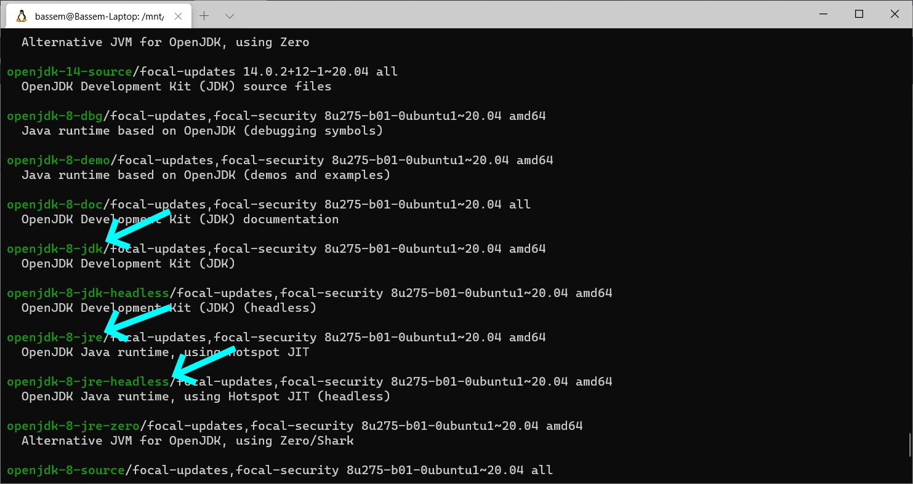
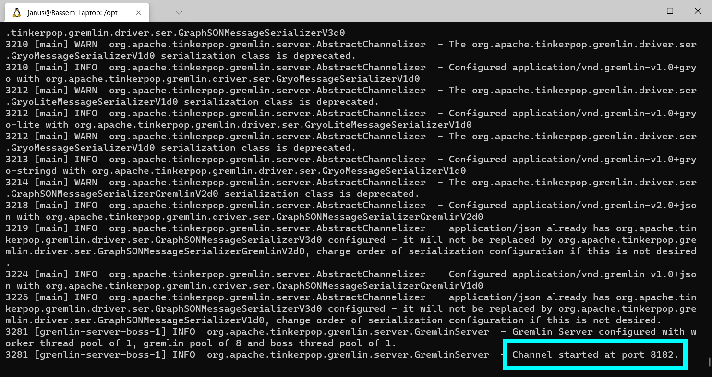
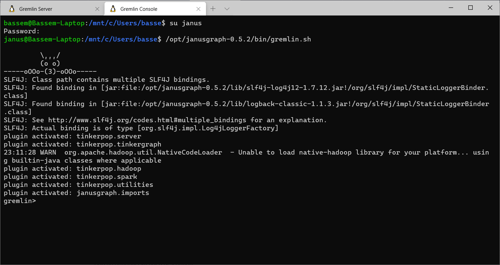

## Installing JanusGraph and Its Storage Backends

# 1. Installing JanusGraph and Testing it With the InMemory Storage Backend

<iframe width="560" height="315" src="https://www.youtube.com/embed/4LWl10oKR_s" frameborder="0" allow="accelerometer; autoplay; clipboard-write; encrypted-media; gyroscope; picture-in-picture" allowfullscreen></iframe>

### Introduction

In this article series, I will explain how to install JanusGraph on a Linux Ubuntu server. And how to install three of its officially supported storage backends (Apache Cassandra, Apache HBase, and Oracle Berkeley DB Java Edition). I will also show how to configure JanusGraph to specify the storage backend we want to use.

In this first article, I will explain how to install JanusGraph itself and how to test it with the InMemory storage backend.

### Install Java 8 JRE

JanusGraph is a Java application. So we need to have the Java JRE or JDK installed on the server to be able to run JanusGraph. At the time of writing this article, [JanusGraph latest release page on Github](https://github.com/JanusGraph/janusgraph/releases/latest) tells us that it was tested with Java 1.8 (which is the same as Java 8). So it is better to install this particular version on the server.

I do not remember the exact package names for Java 8. So I will start by running the `apt search` command.

```shell
apt search openjdk
```

The following image shows some of the output of this command.



The "JDK" (Java Development Kit) is what you install when you need to compile and run Java applications. But in our case, we will download a pre-compiled version of JanusGraph and we will just need to run it. So the "JRE" (Java Runtime Environment) will be enough. Now the choice is between the "JRE" and the "JRE headless" packages. Normally, on servers, you install the headless version which is a minimal version of Java that should be enough for executing non-GUI applications. But for some reason, JanusGraph gave me errors when I tried to run it on the headless version of the JRE. So I ended up having to install the full JRE.

Most of the following shell commands will require Superuser privileges. So switch to the Superuser then enter the command to install the JRE.

```shell
sudo su
apt install openjdk-8-jre
```

### Download and Extract JanusGraph

I place prepackaged application bundles under "/opt". So you can go to this directory or any other directory you like. Then use the "wget" command to download the JanusGraph ZIP file from github. Then the "unzip" command to extract the files from the ZIP archive.

```shell
cd /opt
wget https://github.com/JanusGraph/janusgraph/releases/download/v0.5.2/janusgraph-0.5.2.zip
unzip janusgraph-0.5.2.zip
```

You can get the download link from [JanusGraph's latest release page on Github](https://github.com/JanusGraph/janusgraph/releases/latest). And you may need to install the "unzip" package if you do not already have it.

### Create a Linux User for Running JanusGraph

I think it is a good idea to create a Linux user for running the JanusGraph server. This user can be given only the permissions needed by JanusGraph and not more. This dedicated user will also make it easier to find the JanusGraph server process if we need to monitor it or kill it.

```shell
adduser janus
```

You will be prompted to enter the password for this new user.

Now let's make this newly created user the owner of the JanusGraph directory and all its contents.

```shell
chown -R janus:janus janusgraph-0.5.2
```

### Run the JanusGraph Gremlin Server

Switch to the "janus" user and run the "gremlin-server.sh" shell script

```shell
su janus
/opt/janusgraph-0.5.2/bin/gremlin-server.sh
```

This will start the Gremlin Server and it will listen to port 8182. The following image shows the output of the Gremlin Server.



### Test the Server From the Gremlin Console

Keep the first terminal window/tab open to see the server output logs. And open another terminal. Switch to the "janus" user. And run the JanusGraph Gremlin Console.

```shell
su janus
/opt/janusgraph-0.5.2/bin/gremlin.sh
```



To connect the Gremlin Console to the Gremlin Server running on the same machine, enter the following command in the Gremlin Console.

```
:remote connect tinkerpop.server conf/remote.yaml
```

I suggest you look at the configuration file "remote.yaml" under "/opt/janusgraph-0.5.2/conf/". The most important lines in this file tell the Gremlin Console the hostname "localhost" and the port number "8182" that the server is running on.

To make the Gremlin Console send a command to the server, you need to put `:>` in front of the command. For example

```
:> 1 + 1
```

If you want to make the Gremlin Console send all the commands to the server without having to remember to add `:>`, then you can use the following command

```
:remote console
```

You do not need to create the "Graph" and the "Graph traversal source" objects. The server already has the variables `graph` and `g` defined for you.

```
gremlin> graph
==>standardjanusgraph[inmemory:[127.0.0.1]]
gremlin> g
==>graphtraversalsource[standardjanusgraph[inmemory:[127.0.0.1]], standard]
```

The graph will be initially empty

```
gremlin> g.V().count()
==>0
```

So let's create a couple of vertices

```groovy
g.addV('person').property('name', 'p1')
g.addV('person').property('name', 'p2')
```

And make sure they were saved

```
gremlin> g.V().count()
==>2
```

### Bummer! The Data Is Not Persisted

The default server configuration file "janusgraph-0.5.2/conf/gremlin-server/gremlin-server.yaml" makes JanusGraph use the "InMemory Storage Backend". So the data is not written to any persistent storage. And when you shutdown the server, all the graph data will be lost. Let's test this!

Open the terminal window that was used to run the Gremlin Server and press CTRL + C on your keyboard to shutdown the server. Then enter the following command to start the server again.

```shell
/opt/janusgraph-0.5.2/bin/gremlin-server.sh
```

Then switch to the Gremlin Console terminal. Because we restarted the server, we will need to disconnect the Gremlin Console from the server then reconnect it. Then enter the `:remote console` command to send all subsequent commands to the server.

```
:remote close
:remote connect tinkerpop.server conf/remote.yaml
:remote console
```

Now let's see the vertices count after the server restart

```groovy
gremlin> g.V().count()
==>0
```

This confirms that all the data was lost when we restarted the server.

In the next articles, I will show how to make JanusGraph use storage backends that actually persist the graph data.
